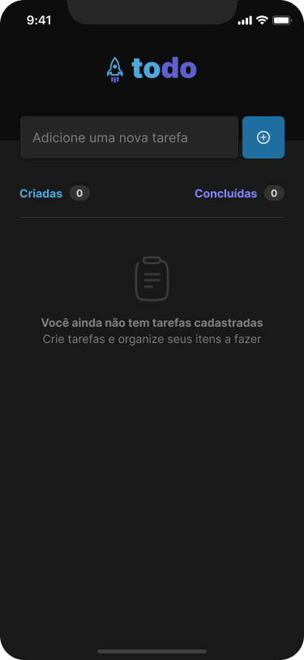

# ignite-react-native-1-To-do

This app is a mobile version of [@To Do List](https://github.com/CristianoAlchaar/ignite-reactjs-1-To-do). Its basically a to do list where user can insert tasks, mark them as done and remove tasks. 

Project developed with __Expo__, __React Native__, __Typescript__

## How to run project

1. Clone this repository to your local machine `gh repo clone CristianoAlchaar/ignite-react-native-1-to-do-list`.
2. Run `npm install` to install dependencies.
3. Run `expo start` to start the development server.
4. Scan QR Code on Expo App on your mobile phone or open it on your emulator.

## Screenshots

Here are some screenshots of the project:

    
Click to view images

    <h2>Empty List Screen</h2>
    
    <h2 style="margin-top: 50px">List Screen</h2>
    

Challenge made for "Ignite React Native" / [@Rocketseat](https://github.com/Rocketseat)

By [Cristiano Alchaar da Silva](https://github.com/CristianoAlchaar)

